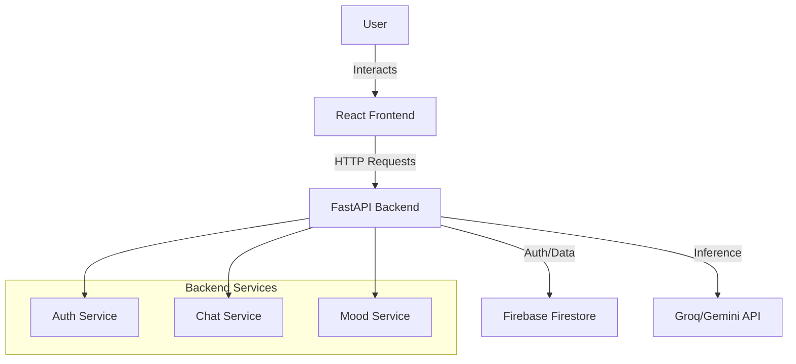

# MindMate MVP - Architecture Guide

## 1. File Structure

```
mindmate-mvp/
├── backend/
│   ├── main.py             # Entry point, FastAPI app, CORS
│   ├── auth.py             # Signup, Login, Logout routes
│   ├── chat.py             # Chat logic, LLM integration, Crisis detection
│   ├── mood.py             # Mood logging and analytics routes
│   ├── user.py             # User profile management
│   ├── database.py         # Firestore CRUD operations
│   ├── prompts.py          # System prompts and personality definitions
│   ├── utils.py            # Helper functions (JWT, Hashing, NLP)
│   ├── requirements.txt    # Python dependencies
│   └── .env                # Secrets (API Keys)
│
├── frontend/
│   ├── src/
│   │   ├── components/     # Reusable UI components
│   │   │   ├── ChatInterface.jsx
│   │   │   ├── Header.jsx
│   │   │   ├── LoadingSpinner.jsx
│   │   │   ├── MoodChart.jsx
│   │   │   └── MoodEmojis.jsx
│   │   ├── context/        # Global state
│   │   │   ├── AuthContext.jsx
│   │   │   └── ChatContext.jsx
│   │   ├── pages/          # Route views
│   │   │   ├── ChatPage.jsx
│   │   │   ├── DashboardPage.jsx
│   │   │   ├── LandingPage.jsx
│   │   │   ├── LoginPage.jsx
│   │   │   ├── MoodTrackerPage.jsx
│   │   │   ├── ProfilePage.jsx
│   │   │   ├── SettingsPage.jsx
│   │   │   └── SignupPage.jsx
│   │   ├── services/       # API clients
│   │   │   ├── api.js      # Axios setup
│   │   │   ├── auth.js     # Auth service
│   │   │   └── firestore.js
│   │   ├── styles/         # CSS files
│   │   ├── App.jsx         # Router configuration
│   │   ├── main.jsx        # Entry point
│   │   └── config.js       # Firebase config
│   ├── index.html
│   └── vite.config.js
│
└── docs/                   # Documentation
```

## 2. Execution Flow

### Request Lifecycle
1.  **Frontend Action**: User clicks a button (e.g., "Send Message").
2.  **Service Layer**: `api.js` intercepts the request and adds the JWT token header.
3.  **Network**: Request sent to `http://localhost:8000/chat`.
4.  **Backend Router**: `main.py` routes request to `chat.py`.
5.  **Logic Layer**: `chat.py` calls `database.py` to get context, then calls LLM function.
6.  **Database Layer**: `database.py` writes result to Firestore.
7.  **Response**: JSON response sent back to frontend.
8.  **UI Update**: React state updates, re-rendering the component.

## 3. Data Flow Diagram


